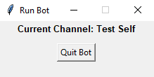
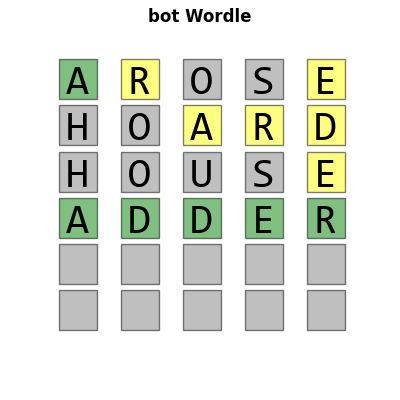

## **Self-bot for GroupMe**

### **About**
Self-bot for GroupMe is an automatic replier that reacts to certain keyword calls from the GroupMe chat that it is deployed in.

### **Basic Setup**
0. Some requirements:
   - In order to be able to launch this bot, you need a valid GroupMe account and Python 3 installed on your computer. Other necessary Python modules should be added when the bot starts.
1. Setting up credentials with `setup.py`:
     - To start out with setting up the appropriate credentials for the app, you first need to log in to the  [GroupMe Developers](https://dev.groupme.com/) website and request your personal token (this takes maybe like 30 seconds).
     - With your token, run `setup.py` by typing in

            py setup.py

          and copy-paste the token that you've just obtained.
     
            Welcome to Self-bot for GroupMe setup

            You can always run this file again to change anything.

            Did you obtain a user token from GroupMe? [Y/n]: Y

            Copy and paste the token right here below.

                    Token: 

         If you answer no to the question above, you get an option to be redirected to the [GroupMe Developers](https://dev.groupme.com/) website, from which you can get your token. It is important that you enter the correct token or you won't be able to launch the bot.

      -  You should then enter a user password that will be used to launch the bot. 

                Enter password for login    

                    Password:    

     - Your credentials will be saved in a `setup.json` file that you can always manually edit to make any changes. You can also run the `setup.py` file again to make changes.
2. Starting the bot with `bot.py`:
    - Now that all of your credentials are set up, you run the `bot.py` program start up your bot. 
        
 In the terminal, navigate to the directory where the program is type in something like: 

          py bot.py

        
 The program will first check and install some necessary modules. When that is completed, it will prompt you to enter a password.

            Enter Password to Login: 
        
        
 Simply enter the password that you set up previously to proceed. If the wrong password is entered, the program will simply exit.

        
Once you've entered the correct password, the terminal will show the following screen:

            Available Channels

            [1]  Channel 1
            [2]  Channel 2
            [3]  Channel 3

            [0]  Exit

            [INPUT CHANNEL NUMBER] >>>

        
Just enter the number corresponding to the channel that you would like to deploy the bot in. If the following message is sent to the group chat:

        > [Your first name]bot Activated 🤡

        
then the bot was successfully set up, and now is ready to do some interesting things.

3. Calling the bot
   - The bot can be called from the chatroom by the `$[Your first name]bot` keyword followed by any *command* keywords
   - Some *command* keywords include: 
     - `echo` - replies with the last message sent before the bot call (the bot does not reply with any bot calls as that could cause problems).
     - `time` - replies with the current time.
     - `hi` - replies with 
       
       > Hi [Caller full name] 😀! 

     - `like` - likes the last message sent before the bot call...TWICE!
     - `deactivate` - raises a `KeyboardInterrupt` that deactivates the bot.

   - The terminal will constantly update and look for new bot calls. As of right now, the most recent 2 chat messages are shown, but this can easily be changed within `bot.py`.
   
            Current Channel: Test Self

            [01]         [Caller Name] :  $[Your first name]bot approve
            [02]            [Bot Name] :  I approve 👍

            Updated: 04/17 00:00:49

4. Taking down the bot
   - The simplest way to take down the bot is just to kill the terminal that currently hosts it, but another way to do this would be to press the `Quit Bot` button on the small UI window
  
     

     
Pressing the button will signal the chatroom that the bot has been taken down by sending:

     > [Your first name]bot Deactivated 😢

### **Features as of 4/17/2022**
- **Websearch URLs**
  - The bot returns web search URLs for the following keywords:
    - `google` - replies with a Google search url
    - `youtube` - replies with a Youtube search url
    - `wiki` - replies with a Wikipedia search url
    - `dictionary` - replies with a dictionary.com search url
    - `thesaurus` - replies with a thesaurus.com search url
    
    
 For example, given something like: 

    > $[Your first name]bot google Detroit Tigers

    
 The bot would reply with: 

    
    > Here's what I found: https://www.google.com/search?q=Detroit+Tigers
- **Wordle**
  - Users in the chat are able to play a simple wordle game by adding their word guesses after the `wordle` keyword.
  
    
 With the message: 

    > $[Your first name]bot wordle hello

    
 The bot would send an image of a wordle board at its current state: 
  

    

  - The game doesn't reset until the current one is over or someone guesses the correct word.
    
 If no one can guess the right word, the bot replies: 

    > Everyone loses 😥. The word was GRUFF.

    
 Or with whatever the correct word was. 
 
    
 Else if someone is able to come up with the correct word, then the bot replies: 

    > [Someone] Wins! 

    
 Where [Someone] would be the first name of the person who guessed right. It also shows you the picture of the nice board. 
 
    
    
  
  - The bot checks for invalid inputs. It doesn't take word guesses that are:
    - not 5 letters long, or
    - is not in the `words.txt` file included in the same directory.
    
In each case the bot points out what's wrong: 

    > Invalid word length!
    
    
or

    
    > Invalid word input!

- **Other Features in the Admin Version**
  - These are some other features that aren't included because of privacy reasons
    - sending emails
    - The ability to run shell commands and take read the terminal output